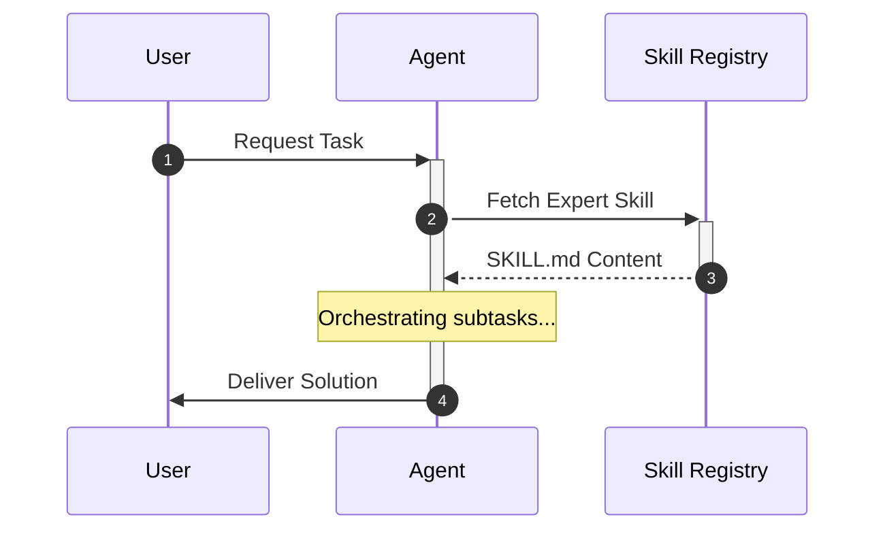
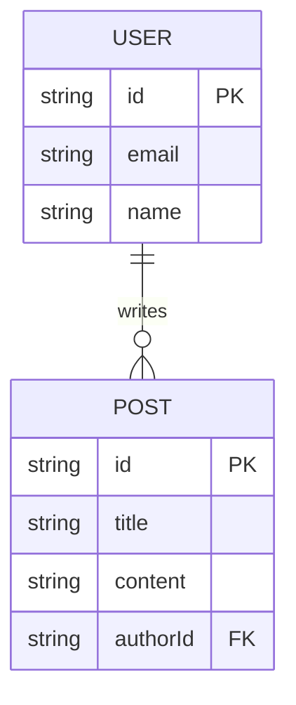
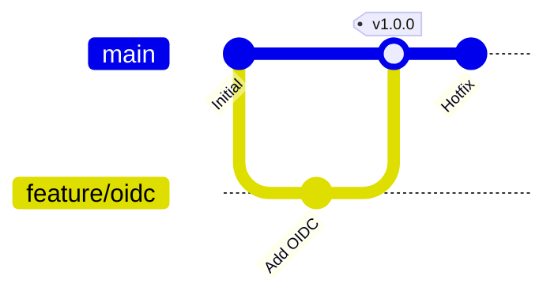
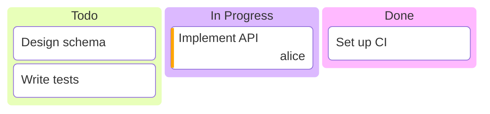
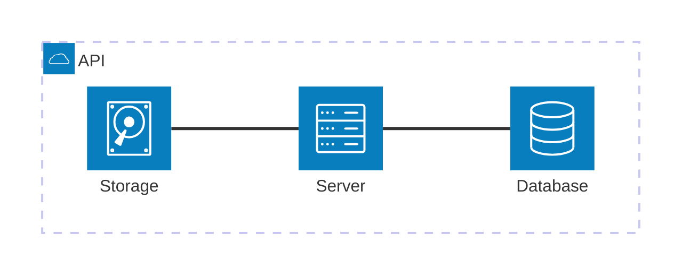

## Core Principle

Never use static images for technical docs. Use raw Mermaid syntax in Markdown. Store complex, reusable diagrams in `.mermaid` files under `assets/`.

## Diagram Type Selection

| Need                    | Diagram Type     |
| ----------------------- | ---------------- |
| Control flow / logic    | Flowchart        |
| Service interactions    | Sequence Diagram |
| Database schema         | ERD              |
| Branching / release     | Gitgraph         |
| Lifecycle / transitions | State Diagram    |
| Task boards / workflow  | Kanban           |
| Timeline / milestones   | Timeline         |
| Hierarchical concepts   | Mindmap          |
| System topology         | Architecture     |
| Network packet layout   | Packet           |
| Priority / positioning  | Quadrant Chart   |

## Sequence Diagrams

Use `autonumber`, `activate/deactivate`, and `Note` to make interactions explicit. Map every message to a specific function call or network request.

## Entity-Relationship Diagrams

Use Crow's Foot notation. Always include data types and PK/FK indicators. Derive ERDs from Drizzle/Prisma schemas to prevent drift.

## Gitgraph Diagrams

Use for PR descriptions involving complex branching. Standardize on `main`, `develop`, and `feature/*` branch naming.

## Kanban Diagrams

Visualize task workflow states with columns and task metadata:

## Architecture Diagrams

Map system topology with services and connections:

## Anti-Patterns

| Anti-Pattern                     | Why It Fails             | Fix                                       |
| -------------------------------- | ------------------------ | ----------------------------------------- |
| 20+ nodes without grouping       | Unreadable, no hierarchy | Use subgraphs to group related nodes      |
| Default colors on critical paths | Important paths blend in | Custom styles to highlight critical flows |
| Crossing lines in flowcharts     | Visual noise             | Switch orientation (`LR` vs `TD`)         |
| No accessibility summary         | Excludes screen readers  | Provide text summary of diagram meaning   |
| Generic participant names        | Context lost             | Use specific service or role names        |

## Managing Complexity

When a diagram becomes cluttered:

1. Break into multiple focused diagrams
2. Use subgraphs for grouping related nodes
3. Change layout direction (`TD` to `LR` or vice versa)
4. Limit to 15-20 nodes per diagram

## Troubleshooting

### Mermaid Render Failures

**Symptom**: Diagram renders as raw text or errors.

**Common causes**:

- Missing participant declarations
- Unmatched `activate/deactivate` pairs
- Unsupported syntax in older renderers

**Fix**: Validate syntax with the [Mermaid Live Editor](https://mermaid.live) or a verification script.

### ERD Schema Drift

**Symptom**: ERD no longer matches database schema.

**Fix**: Regenerate from Drizzle/Prisma schema. Diff the output against the committed `.mermaid` file.
