# Class Diagrams

## Declaration

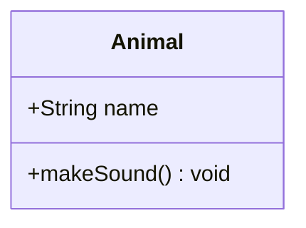

## Defining Classes

### Bracket Syntax

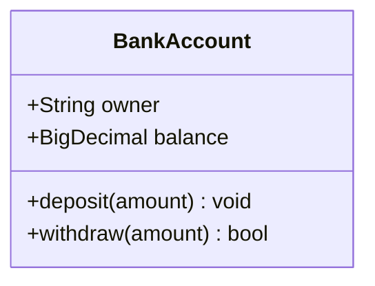

### Colon Syntax

Both syntaxes produce identical output. Bracket syntax is preferred for readability.

## Visibility Modifiers

| Symbol | Access    |
| ------ | --------- |
| `+`    | Public    |
| `-`    | Private   |
| `#`    | Protected |
| `~`    | Package   |

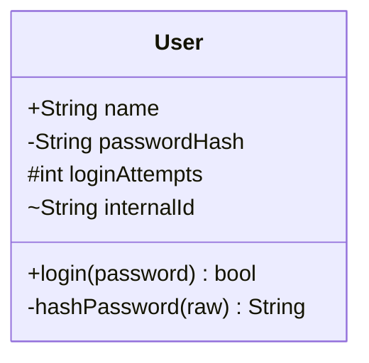

## Method Classifiers

| Suffix | Meaning  |
| ------ | -------- |
| `*`    | Abstract |
| `$`    | Static   |

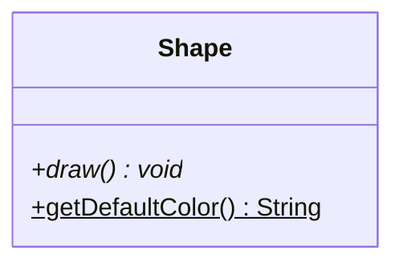

## Return Types

Specify return types after the method signature.

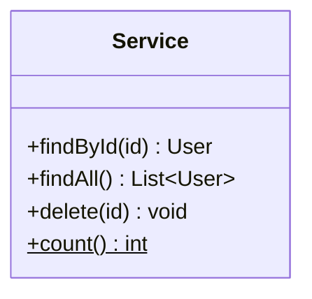

## Generics

Use tildes to denote generic types.

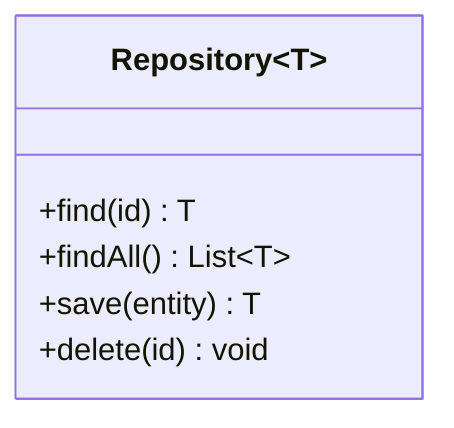

## Relationships

Eight relationship types are supported, each with distinct arrow syntax.

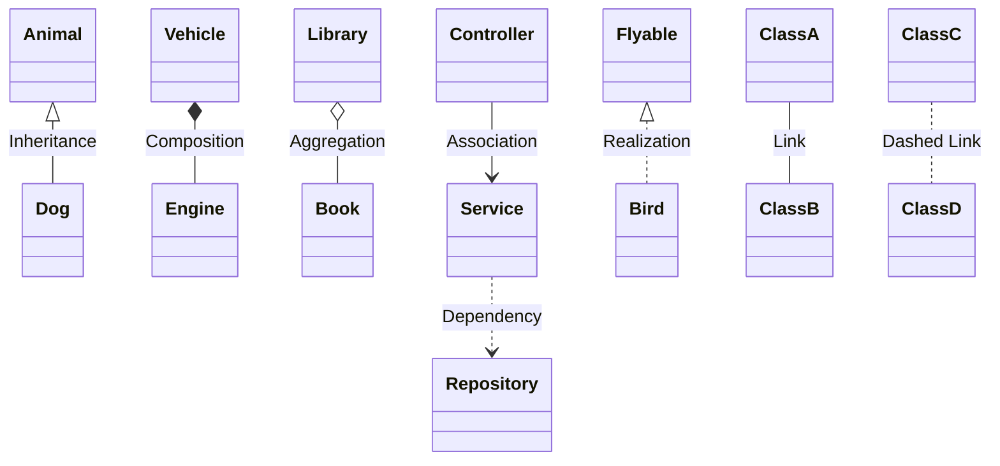

| Arrow   | Type          | Meaning                              |
| ------- | ------------- | ------------------------------------ |
| `<\|--` | Inheritance   | Child extends parent                 |
| `*--`   | Composition   | Part cannot exist without whole      |
| `o--`   | Aggregation   | Part can exist independently         |
| `-->`   | Association   | Uses or references                   |
| `..>`   | Dependency    | Depends on (weaker than association) |
| `..\|>` | Realization   | Implements interface                 |
| `--`    | Link (solid)  | General connection                   |
| `..`    | Link (dashed) | General dashed connection            |

### Bidirectional Relationships

Combine relation types for two-way relationships.

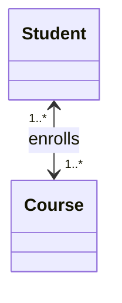

## Cardinality Labels

Place cardinality on either side of the relationship.

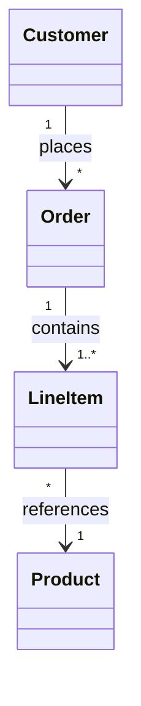

| Notation | Meaning     |
| -------- | ----------- |
| `1`      | Exactly one |
| `0..1`   | Zero or one |
| `1..*`   | One or more |
| `*`      | Many        |
| `n`      | N instances |
| `0..n`   | Zero to N   |

## Annotations

Mark classes with stereotypes.

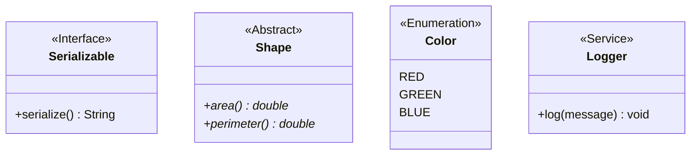

Available annotations: `<<Interface>>`, `<<Abstract>>`, `<<Service>>`, `<<Enumeration>>`.

## Namespaces

Group related classes into namespaces.

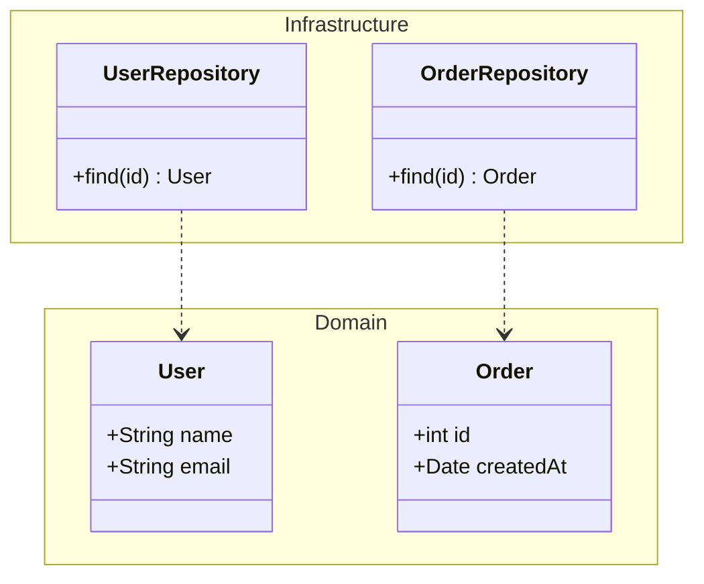

## Notes

Add notes to the diagram or to specific classes.

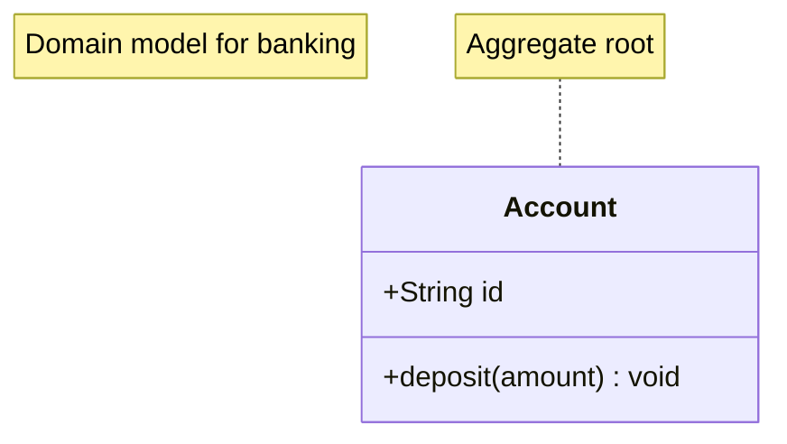

## Lollipop Interfaces

Show interface implementation with a compact notation.

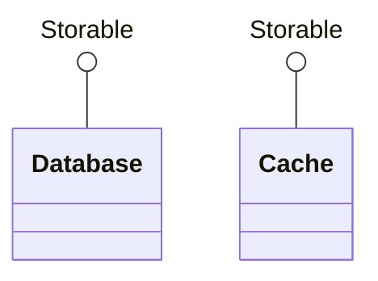

## Styling

Apply CSS-like styles to individual classes.

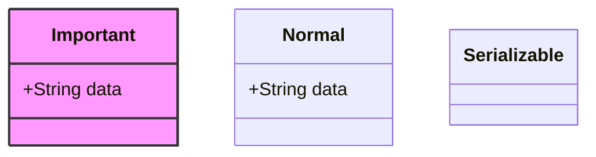

## Complete Example

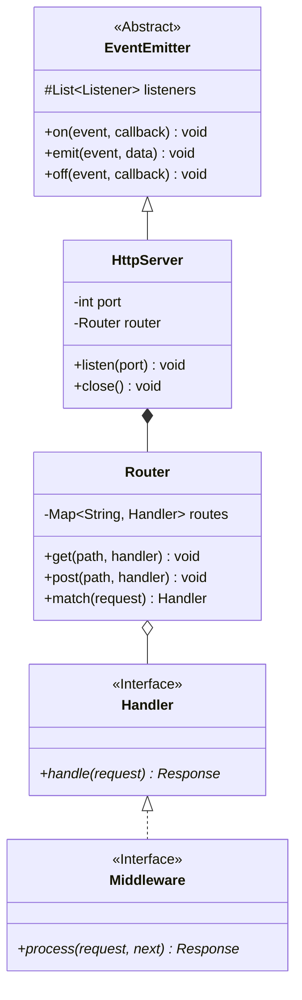
