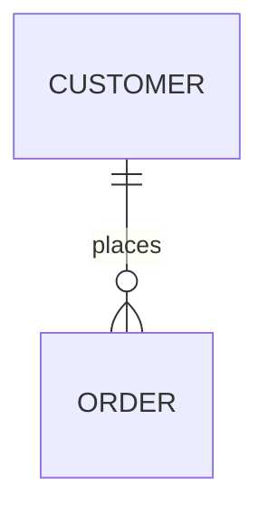
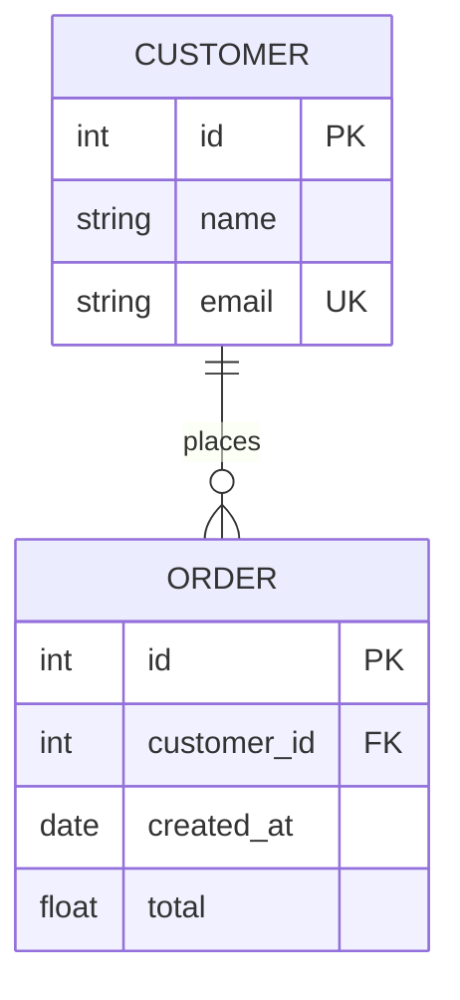
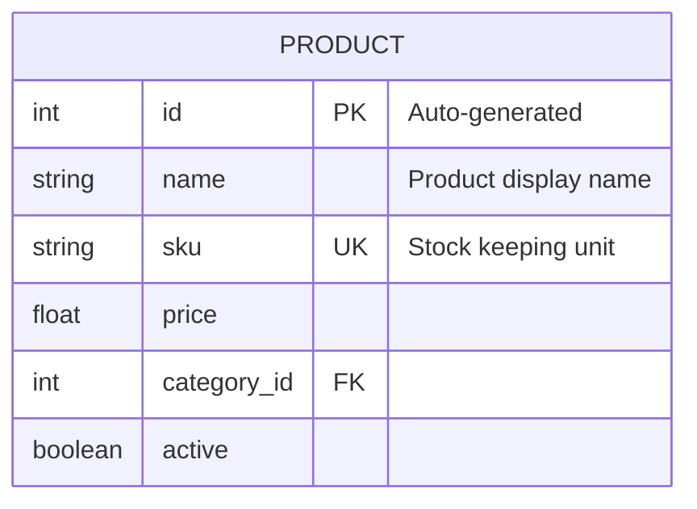
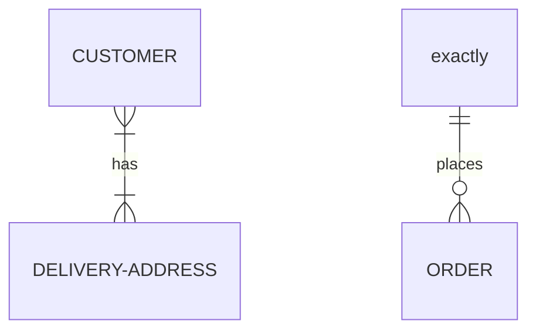
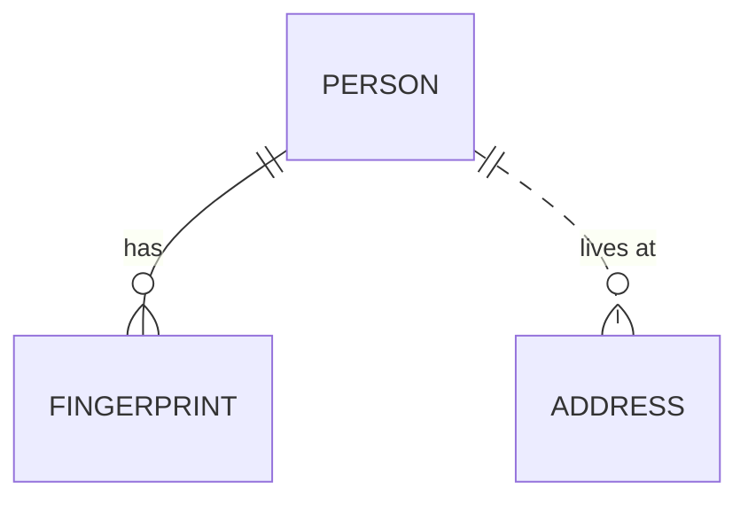
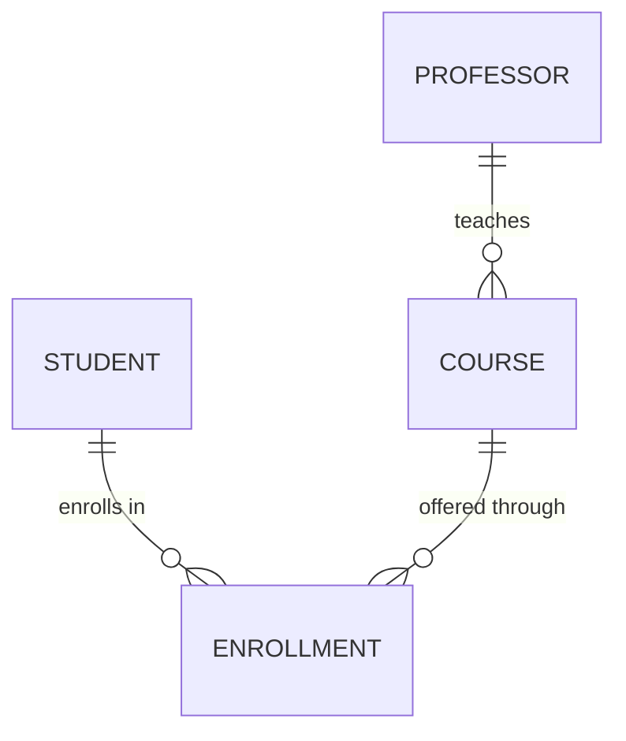
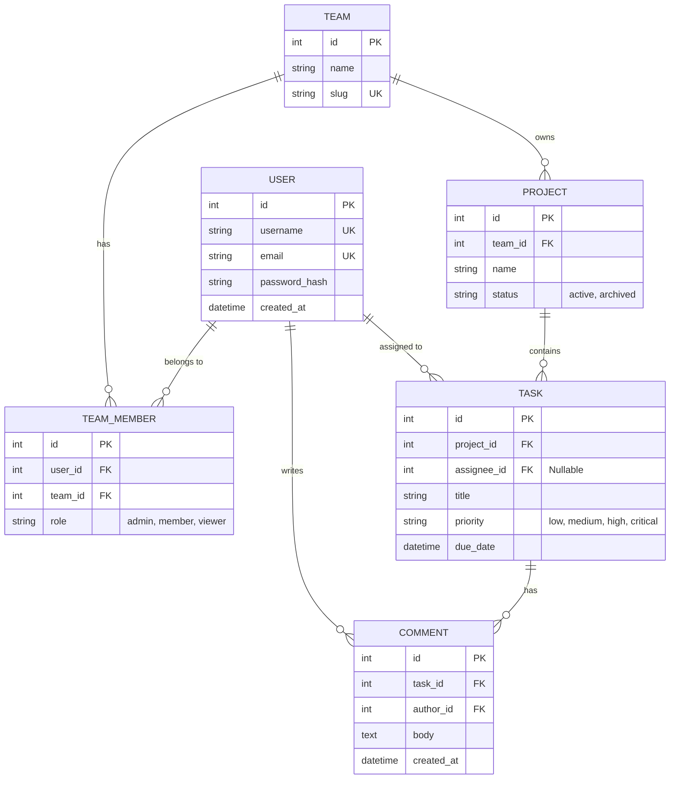

# Entity-Relationship Diagrams

## Declaration



## Basic Syntax

Each line follows the pattern:

```text
<entity> [<relationship> <entity> : <label>]
```

Only the first entity name is required. The relationship, second entity, and label are optional.

## Entities

Entities are automatically created when referenced. Names should use uppercase or PascalCase by convention.



## Attributes

Define attributes inside entity braces with the format: `type name [key] ["comment"]`.



| Key  | Meaning     |
| ---- | ----------- |
| `PK` | Primary Key |
| `FK` | Foreign Key |
| `UK` | Unique Key  |

Keys and comments are optional. Multiple keys can appear on a single attribute.

## Cardinality (Crow's Foot Notation)

Relationships use two-character markers on each side of the connecting line.

| Left   | Right  | Meaning      |
| ------ | ------ | ------------ |
| `\|o`  | `o\|`  | Zero or one  |
| `\|\|` | `\|\|` | Exactly one  |
| `}o`   | `o{`   | Zero or more |
| `}\|`  | `\|{`  | One or more  |

### Reading Cardinality

Read relationships from left entity to right entity:

```text
CUSTOMER ||--o{ ORDER : places
```

- Left side `||` = "exactly one" CUSTOMER
- Right side `o{` = "zero or more" ORDERS
- Reads: "One customer places zero or more orders"

### Word Aliases

Mermaid supports English aliases for cardinality markers:



Available aliases: `"one or zero"`, `"zero or one"`, `"one or more"`, `"one or many"`, `"many(1)"`, `"1+"`, `"zero or more"`, `"zero or many"`, `"many(0)"`, `"0+"`, `"only one"`, `"exactly one"`, `"1"`.

## Relationship Lines

| Syntax | Type                     | Visual      |
| ------ | ------------------------ | ----------- |
| `--`   | Identifying (solid line) | Solid line  |
| `..`   | Non-identifying (dashed) | Dashed line |

Identifying relationships mean the child entity cannot exist without the parent.



- `PERSON ||--o{ FINGERPRINT` = identifying (fingerprint depends on person)
- `PERSON ||..o{ ADDRESS` = non-identifying (address exists independently)

## Relationship Labels

Labels describe the nature of the relationship. Wrap multi-word labels in double quotes.



## Complete Example



## Tips

- Entity names cannot contain spaces; use underscores or PascalCase
- Attribute types are freeform strings (not validated against a type system)
- The colon before the relationship label is required
- Relationship labels are displayed on the connecting line
- Use identifying (`--`) for strong dependencies and non-identifying (`..`) for loose associations
