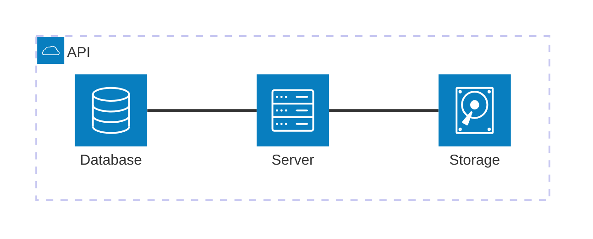
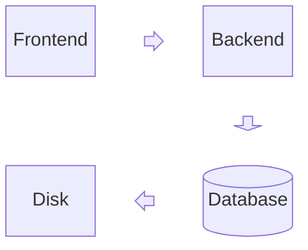
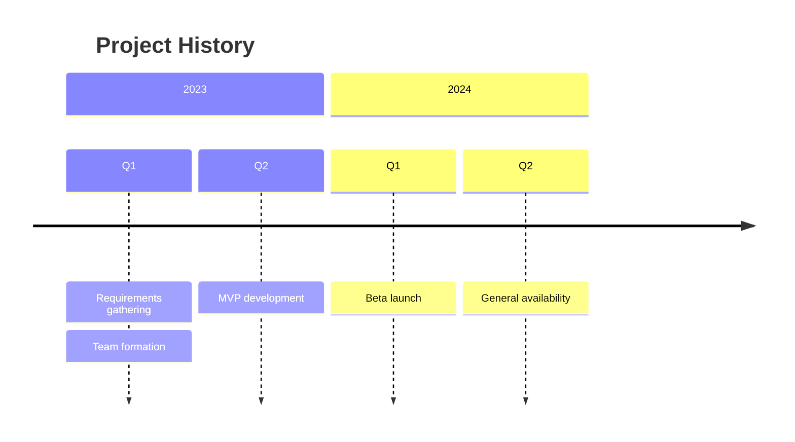
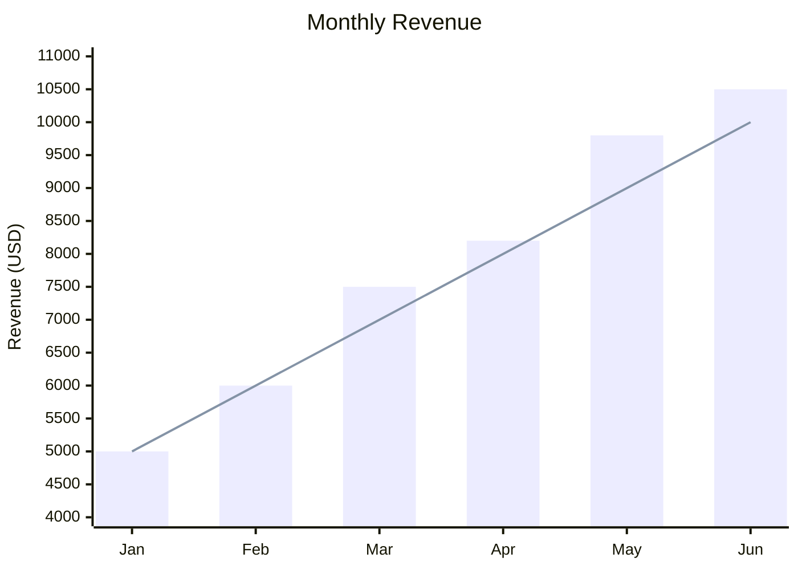
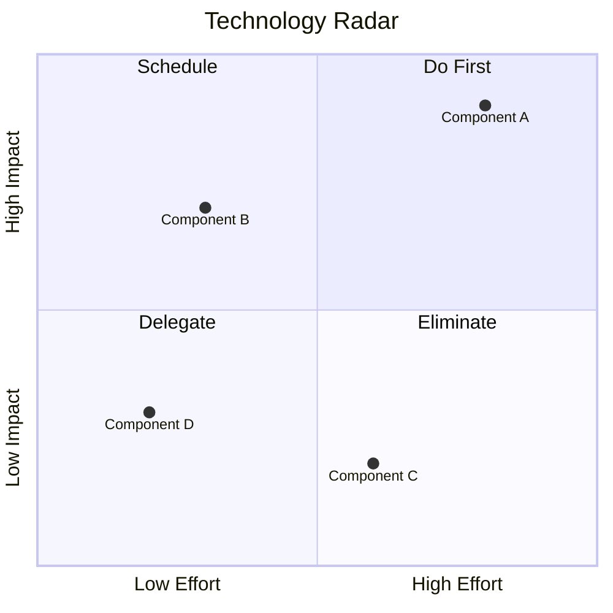
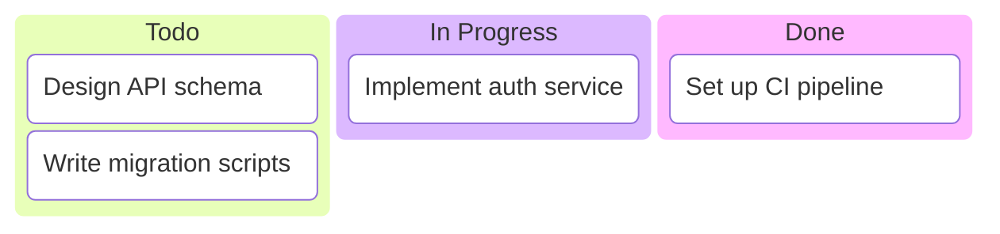
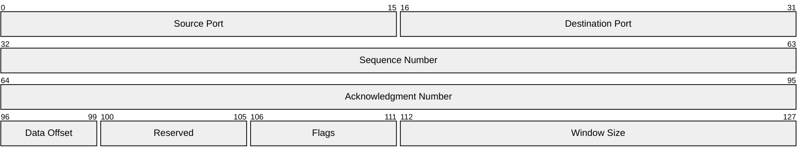
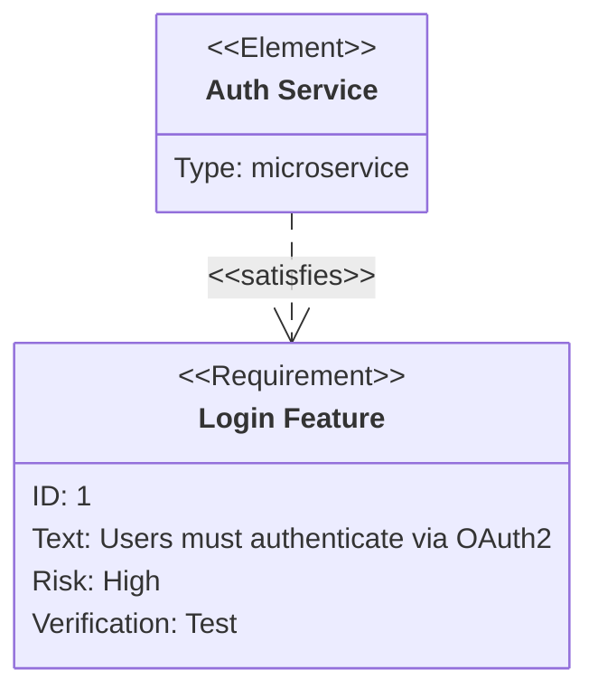
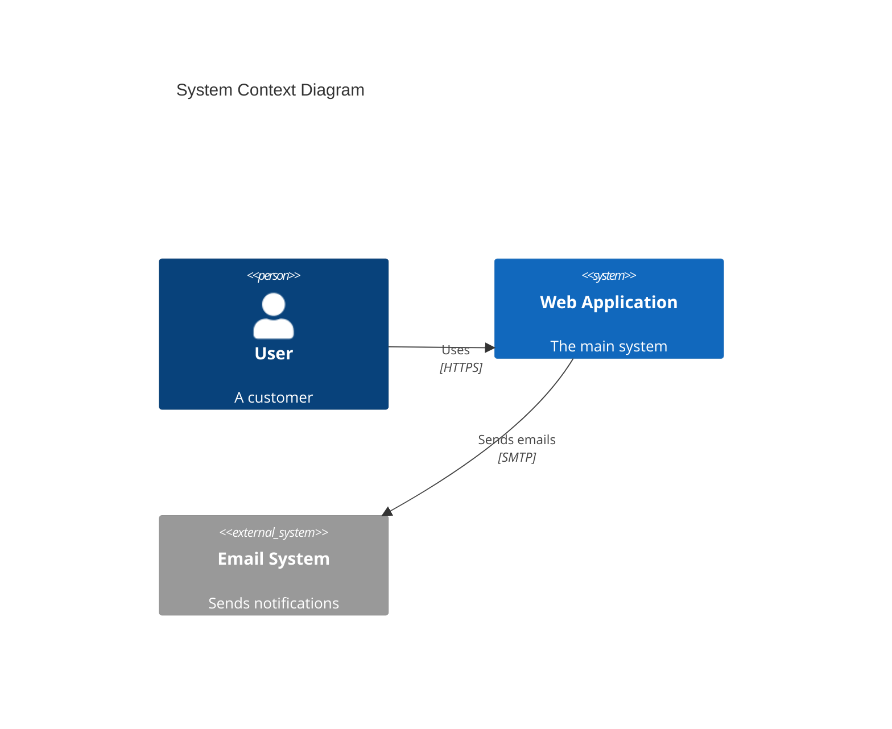

# Extended Diagrams

Mermaid v11 introduced several diagram types beyond the core set. Many use `-beta` suffixes in their declarations.

## Architecture Diagrams

Visualize system architecture with services, groups, and directional edges.



Key syntax:

- `group name(icon)[Label]` -- define a group with an icon
- `service name(icon)[Label] in group` -- place a service in a group
- `service:PORT -- PORT:service` -- connect with directional edges
- Ports: `T` (top), `B` (bottom), `L` (left), `R` (right)
- Icons: `cloud`, `database`, `server`, `disk`, `internet`

## Block Diagrams

Grid-based layout with columns, block arrows, and nested blocks.



Key syntax:

- `columns N` -- set grid column count
- `space` or `space:N` -- insert empty cells
- `id<["label"]>(direction)` -- block arrow (up, down, left, right)
- Standard node shapes from flowcharts work inside blocks

## Timeline Diagrams

Display chronological events grouped by time periods.



Key syntax:

- `title` -- optional diagram title
- `section Name` -- group events by time period
- Indent events under their time period
- Multiple events per period separated by `:` on new lines

## Sankey Diagrams

Visualize flow quantities between nodes using a CSV-like format.

```mermaid
sankey-beta

Agricultural "waste",Bio-conversion,124.729
Bio-conversion,Liquid,0.597
Bio-conversion,Losses,26.862
Bio-conversion,Solid,280.322
Bio-conversion,Gas,81.144
```

Key syntax:

- Each line: `source,target,value`
- Values determine the width of flow connections
- Nodes are created automatically from source/target names
- Wrap node names in quotes if they contain commas

## XY Charts

Bar and line charts with labeled axes.



Key syntax:

- `x-axis [labels]` or `x-axis "Label" min --> max`
- `y-axis "Label" min --> max`
- `bar [values]` -- bar chart data
- `line [values]` -- line chart data
- Multiple `bar` and `line` series supported

## Quadrant Charts

Four-quadrant plots for comparative analysis.



Key syntax:

- `x-axis` and `y-axis` define axis labels with arrows for direction
- `quadrant-1` through `quadrant-4` label each quadrant
- Data points: `Label: [x, y]` with values 0.0 to 1.0

## Kanban Diagrams

Kanban boards with columns and task cards.



Key syntax:

- Column names at top indentation level
- Task cards indented under columns: `[Task title]`
- Task metadata: `id[Title]@{ assigned: 'name', priority: 'High', ticket: 'PROJ-123' }`
- Configure ticket URLs: `config.kanban.ticketBaseUrl`

## Packet Diagrams

Visualize network packet structures with bit-range fields.



Key syntax:

- `start-end: "Label"` -- define a field spanning bit range
- `+N: "Label"` -- auto-increment N bits from previous position
- Default row width is 32 bits (configurable)

## Requirement Diagrams

Model requirements with elements and verification relationships.



Requirement types: `requirement`, `functionalRequirement`, `performanceRequirement`, `interfaceRequirement`, `physicalRequirement`, `designConstraint`.

Relationships: `contains`, `copies`, `derives`, `satisfies`, `verifies`, `refines`, `traces`.

## C4 Diagrams

Model software architecture using the C4 model at four levels.



Diagram levels:

- `C4Context` -- system context (people and systems)
- `C4Container` -- containers within a system
- `C4Component` -- components within a container
- `C4Deployment` -- deployment nodes and infrastructure

Key elements:

- `Person(id, "Name", "Description")`
- `System(id, "Name", "Description")` / `System_Ext` for external
- `Container(id, "Name", "Tech", "Description")` / `ContainerDb`
- `Component(id, "Name", "Tech", "Description")`
- `Container_Boundary(id, "Label") { ... }` for grouping
- `Rel(from, to, "Label", "Tech")` for relationships
