# Flowcharts

## Declaration and Direction

Start with `flowchart` followed by a direction keyword.

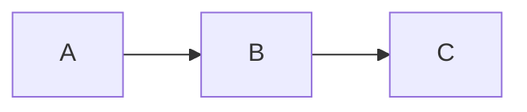

| Direction | Meaning         |
| --------- | --------------- |
| `TB`      | Top to bottom   |
| `TD`      | Top-down (= TB) |
| `BT`      | Bottom to top   |
| `RL`      | Right to left   |
| `LR`      | Left to right   |

## Node Shapes

Nodes are defined by their ID and shape delimiters. Text inside the delimiters becomes the label.

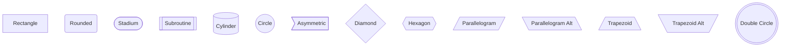

### Extended Shapes (v11.3.0+)

Use the `@{ shape: name }` syntax for additional shapes.

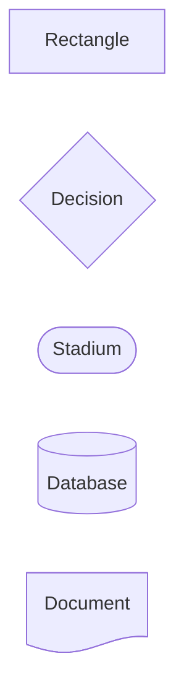

## Edge Types

Edges connect nodes with various line styles and terminators.

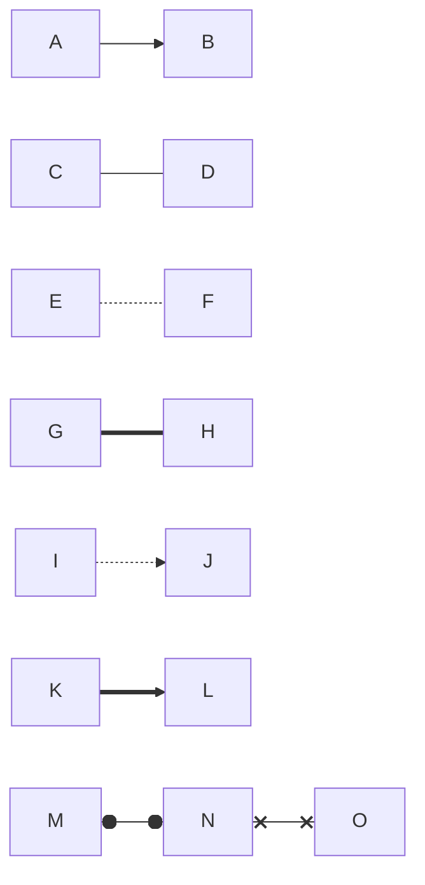

| Syntax | Description         |
| ------ | ------------------- |
| `-->`  | Arrow               |
| `---`  | Open link           |
| `-.-`  | Dotted link         |
| `===`  | Thick link          |
| `-.->` | Dotted arrow        |
| `==>`  | Thick arrow         |
| `o--o` | Circle endpoints    |
| `x--x` | Cross endpoints     |
| `<-->` | Bidirectional arrow |

### Edge Labels

Add text to edges using pipe syntax or inline text.

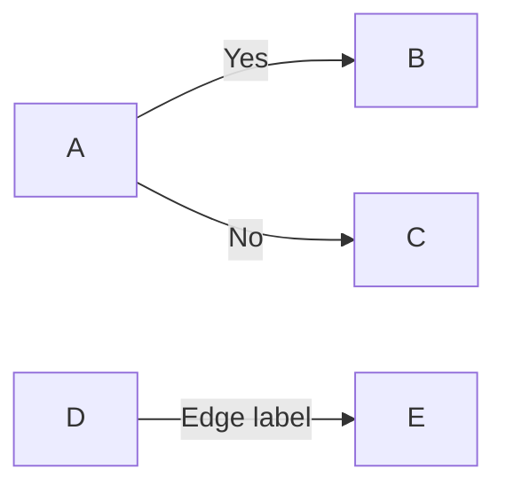

### Multi-length Edges

Add extra characters to increase edge length.

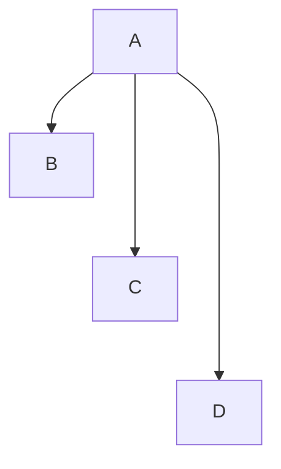

## Subgraphs

Group related nodes inside subgraphs. Subgraphs can be nested and can have their own direction.

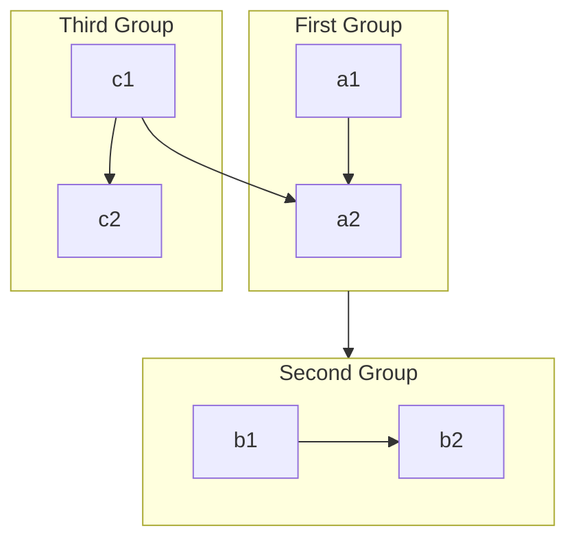

Key rules:

- Subgraph IDs are used for edges between subgraphs
- Use `direction` inside a subgraph to override parent direction
- If a subgraph node links to the outside, direction is inherited from parent
- Subgraphs can be nested arbitrarily deep

## Styling

### Class Definitions

Define reusable styles with `classDef` and apply them with `class` or the `:::` shorthand.

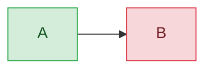

### Inline Styles

Apply styles directly to specific nodes or links.

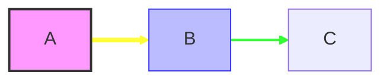

The `linkStyle` index corresponds to the order edges appear in the definition (0-based).

### Default Styling

Apply a style to all nodes using the `default` class.

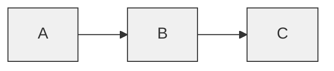

## Click Interactions

Bind click events to nodes for callbacks or navigation.

Supported targets: `_self`, `_blank`, `_parent`, `_top`.

## Markdown Strings

Use double quotes with backticks for rich text formatting in labels.

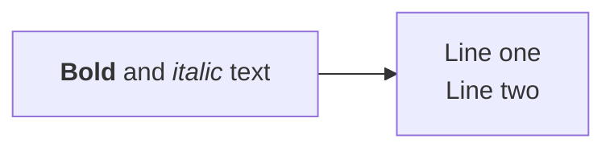

Markdown strings support bold, italics, and automatic text wrapping.

## Comments

Add comments with `%%` at the start of a line.

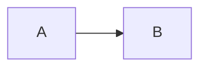

## Complete Example

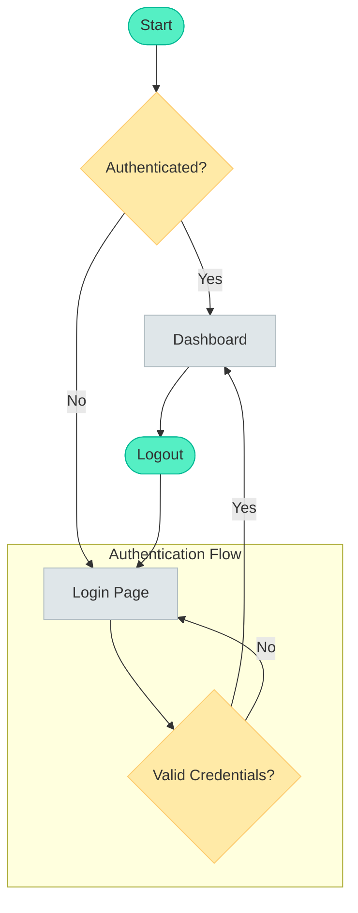
