# Other Diagrams

## Gantt Charts

Gantt charts visualize project schedules with tasks, durations, and dependencies.

### Basic Structure

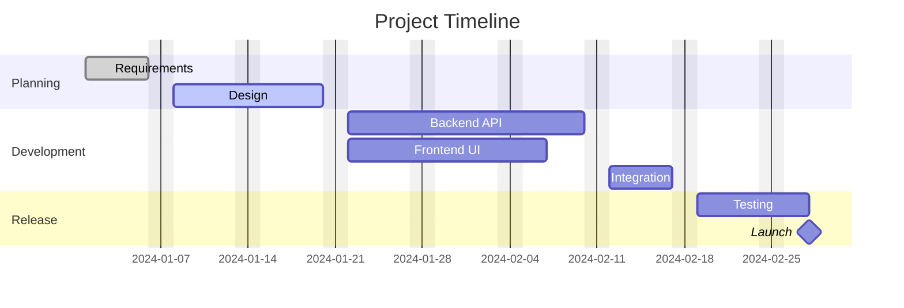

### Task Modifiers

| Modifier    | Effect                    |
| ----------- | ------------------------- |
| `done`      | Marks task as completed   |
| `active`    | Marks task as in progress |
| `crit`      | Marks as critical path    |
| `milestone` | Zero-duration marker      |

### Date Formats

Set with `dateFormat`. Common formats: `YYYY-MM-DD`, `DD-MM-YYYY`, `YYYY-MM-DDTHH:mm`.

### Duration Syntax

Tasks accept absolute dates or relative durations.

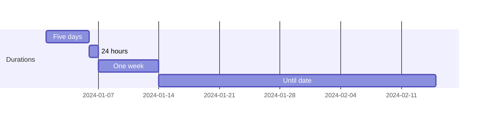

### Dependencies

Use `after <task-id>` to chain tasks.

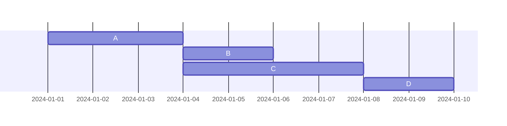

Task D starts after both B and C complete.

## Pie Charts

Simple proportional data visualization.

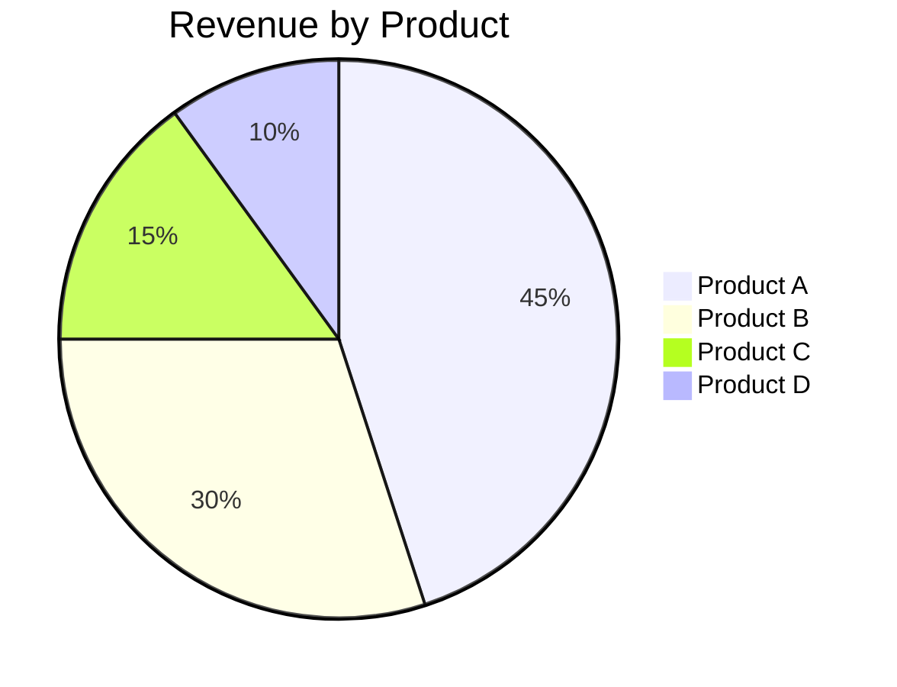

### Show Data Values

Display raw values alongside percentages.

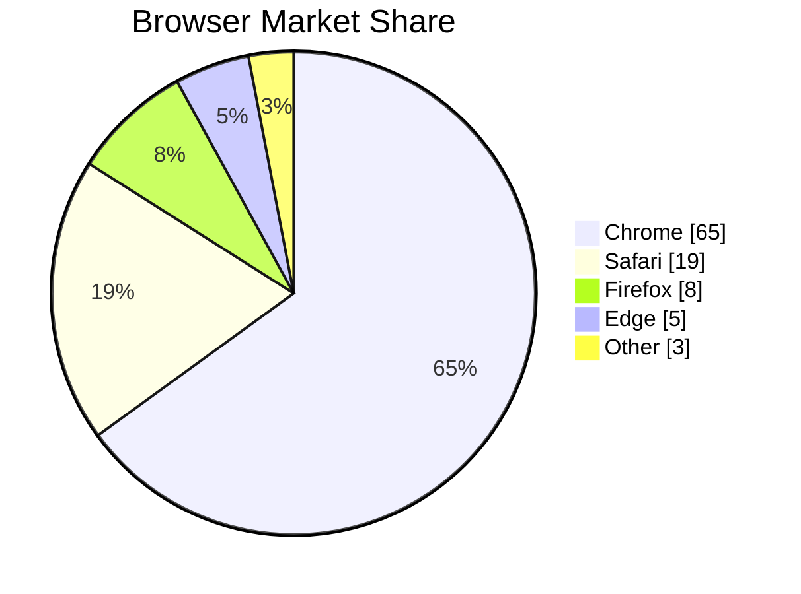

Values are numeric (integers or decimals). Labels must be in double quotes.

## Mindmaps

Hierarchical diagrams using indentation for parent-child relationships.

### Basic Structure

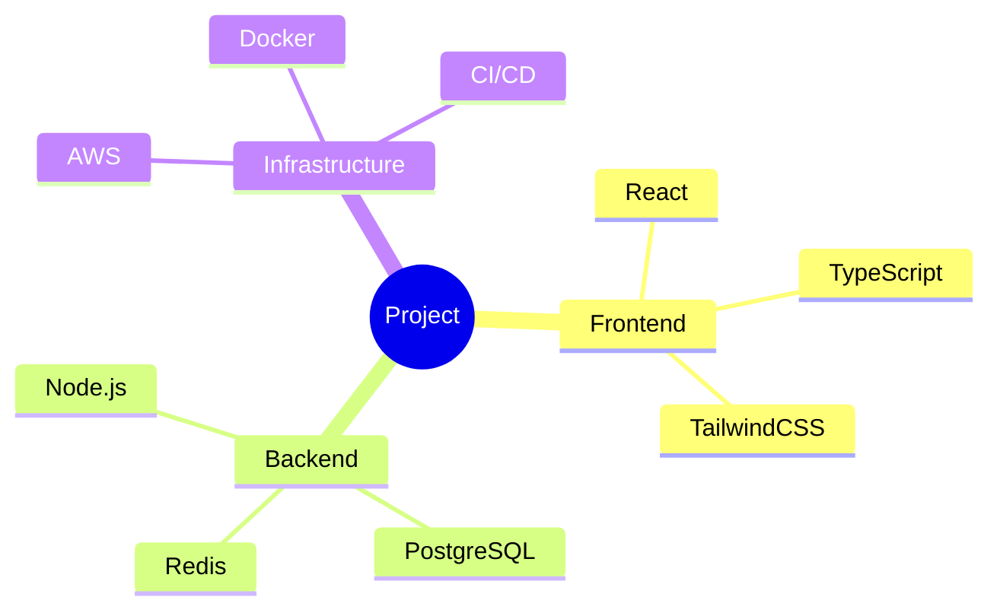

### Node Shapes

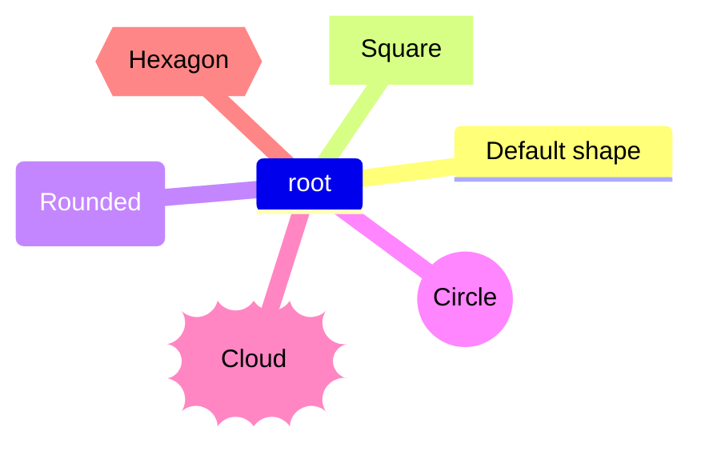

| Syntax     | Shape          |
| ---------- | -------------- |
| Plain text | Default        |
| `[text]`   | Square         |
| `(text)`   | Rounded square |
| `((text))` | Circle         |
| `))text((` | Cloud          |
| `{{text}}` | Hexagon        |

### Icons and Formatting

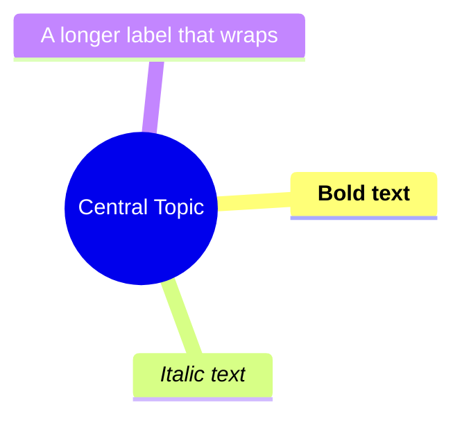

Icons use Font Awesome or Material Design class names with `::icon(class)`.

## State Diagrams

Model state machines with transitions, composite states, and concurrency.

### Basic States and Transitions

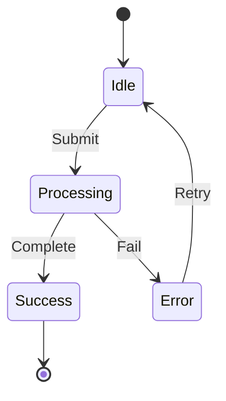

`[*]` represents the start state (when targeted) or end state (when sourced).

### State Descriptions

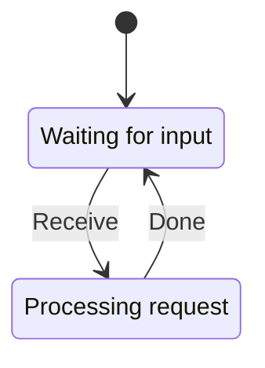

### Composite States

Nest states inside parent states.

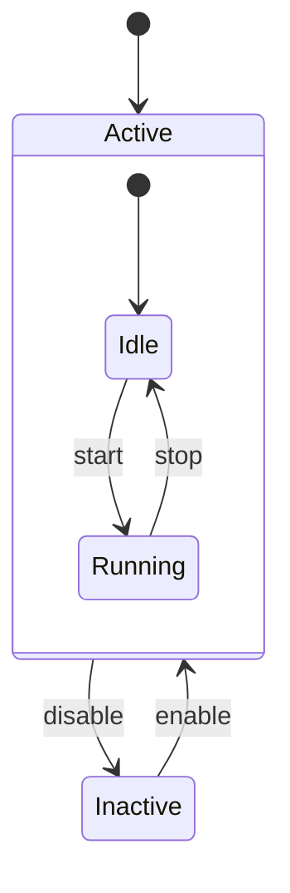

### Choice

Branch transitions based on conditions.

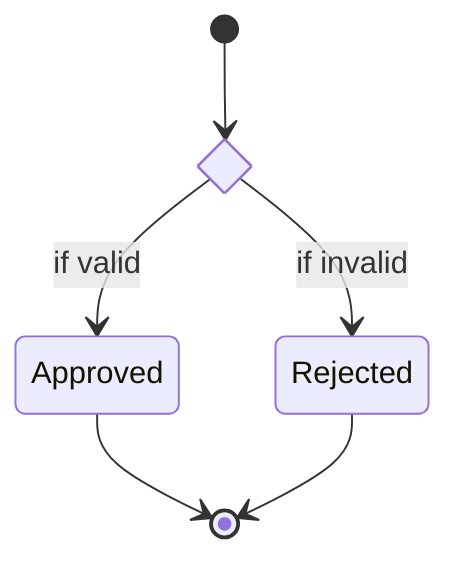

### Forks and Joins

Model parallel execution paths.

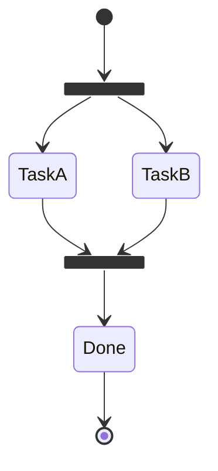

### Concurrency

Show parallel regions within a state using `--`.

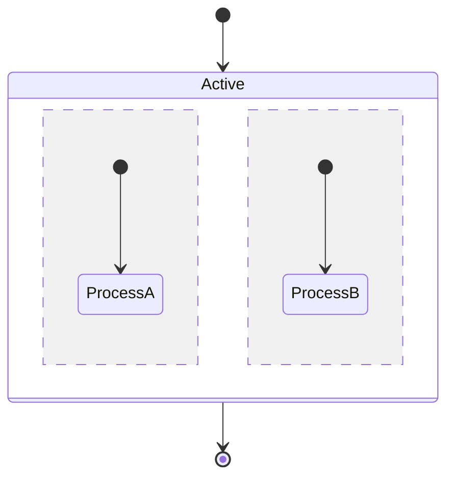

### Notes

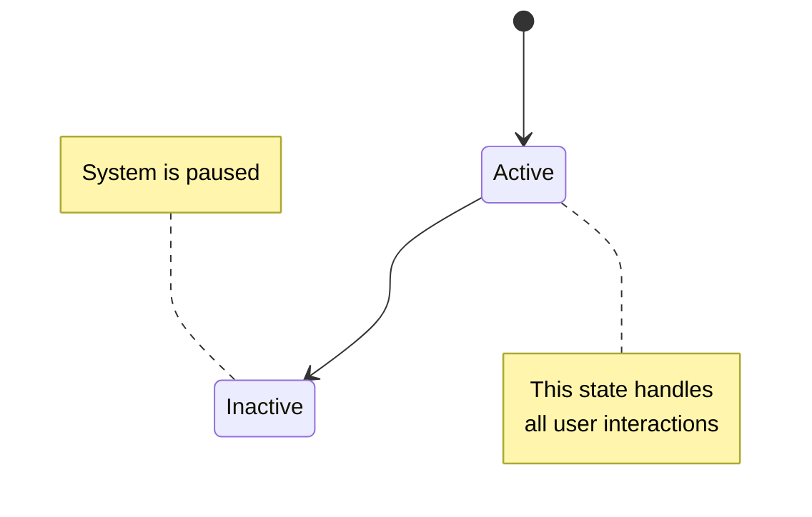

## Git Graphs

Visualize branching, merging, and commit history.

### Basic Commands

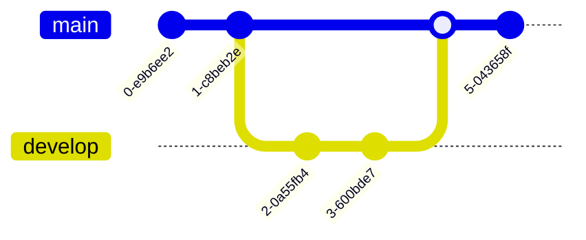

### Commit Options

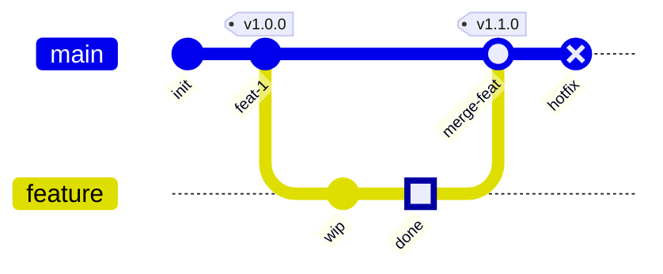

| Option | Values                             |
| ------ | ---------------------------------- |
| `id`   | Custom commit identifier (quoted)  |
| `tag`  | Label displayed on commit (quoted) |
| `type` | `NORMAL`, `REVERSE`, `HIGHLIGHT`   |

### Cherry-pick

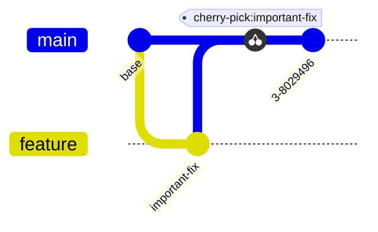

The cherry-picked commit must have a custom `id` and must exist on a different branch.

### Branch Ordering

Control the visual order of branches.

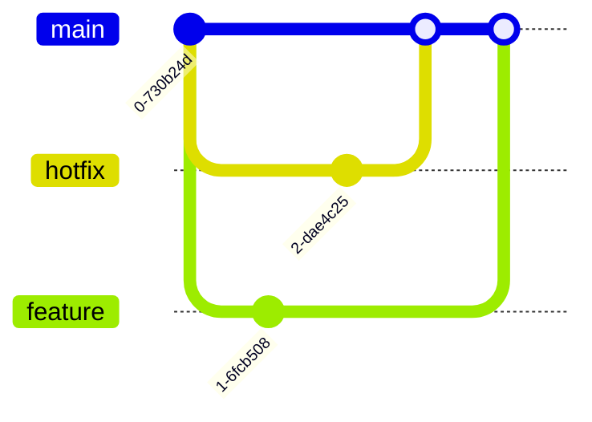

Lower `order` values appear closer to main.

### Orientation

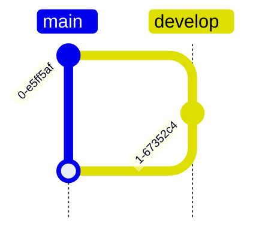

Orientations: `LR` (default, left-to-right), `TB` (top-to-bottom), `BT` (bottom-to-top).

## Configuration

All diagram types support frontmatter configuration.

```mermaid
---
config:
  theme: forest
---
flowchart LR
    A --> B
```

Available themes: `default`, `neutral`, `dark`, `forest`, `base`.
