# Sequence Diagrams

## Declaration

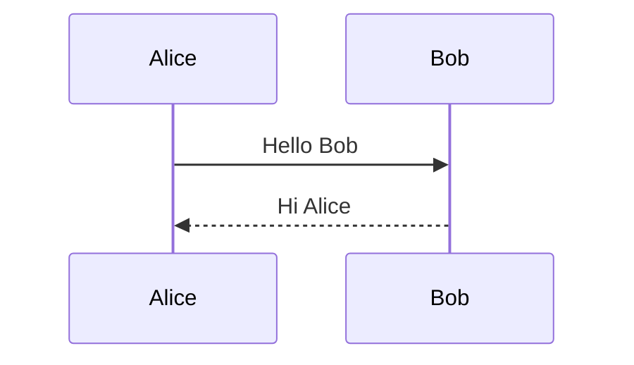

## Participants and Actors

Declare participants explicitly to control ordering, or let them appear implicitly.

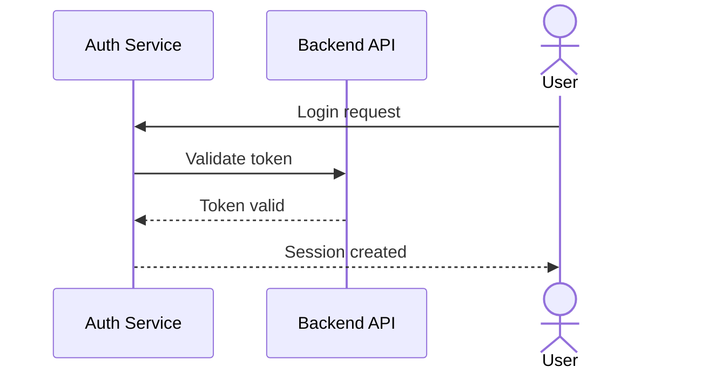

| Keyword       | Rendering        |
| ------------- | ---------------- |
| `participant` | Rectangle box    |
| `actor`       | Stick figure     |
| `boundary`    | Boundary box     |
| `control`     | Control circle   |
| `entity`      | Entity underline |
| `database`    | Database icon    |
| `collections` | Stack icon       |
| `queue`       | Queue icon       |

## Message Arrow Types

| Arrow    | Description                |
| -------- | -------------------------- |
| `->`     | Solid line, no arrowhead   |
| `-->`    | Dotted line, no arrowhead  |
| `->>`    | Solid line with arrowhead  |
| `-->>`   | Dotted line with arrowhead |
| `<<->>`  | Solid bidirectional        |
| `<<-->>` | Dotted bidirectional       |
| `-x`     | Solid line with cross      |
| `--x`    | Dotted line with cross     |
| `-)`     | Solid async arrow          |
| `--)`    | Dotted async arrow         |

## Activations

Show when a participant is actively processing. Use explicit keywords or shorthand notation.

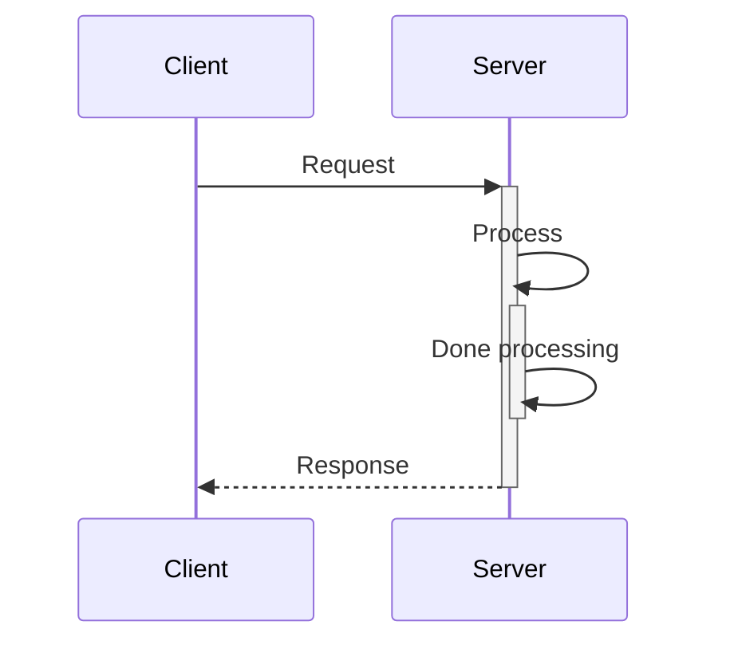

The `+` suffix activates and `-` deactivates. Multiple activations can stack on the same participant.

Explicit form:

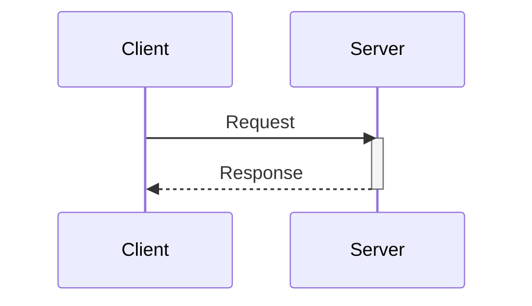

## Loops

Repeat a block of messages.

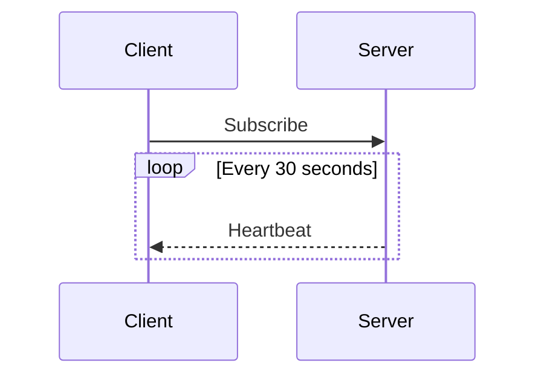

## Alt / Else (Conditional)

Model branching logic with alternative paths.

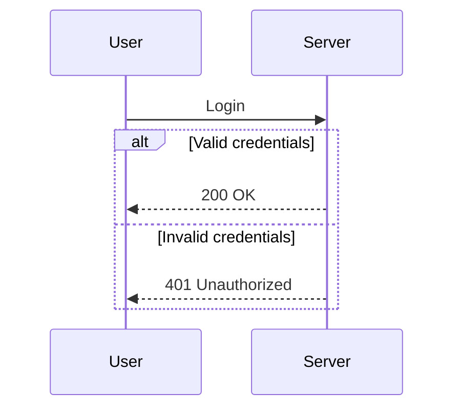

## Opt (Optional)

Model an optional interaction that may or may not occur.

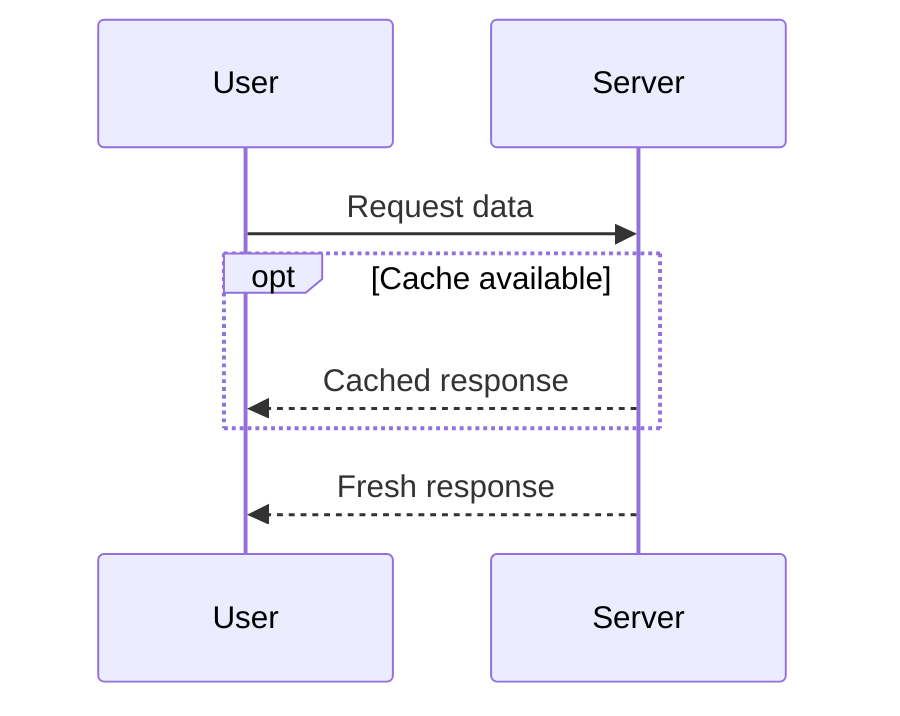

## Par (Parallel)

Show concurrent interactions.

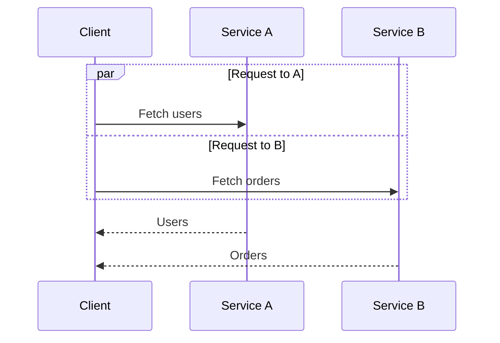

Nested `par` blocks are supported for deeper concurrency.

## Critical Regions

Mark interactions that must succeed, with fallback options.

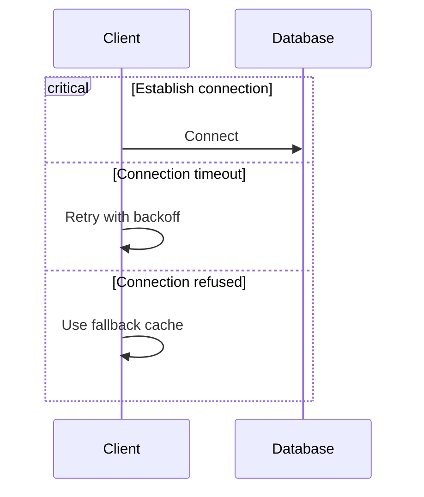

## Break

Exit the sequence flow when a condition is met.

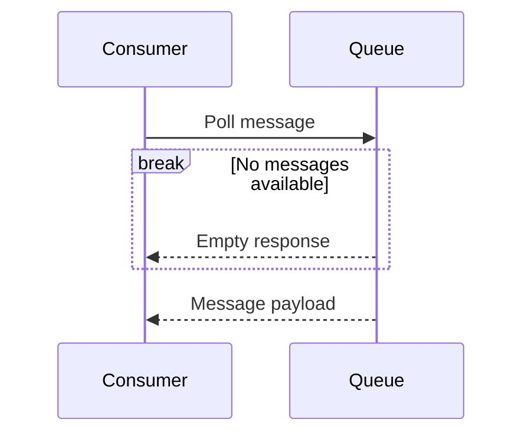

## Notes

Add annotations to specific participants.

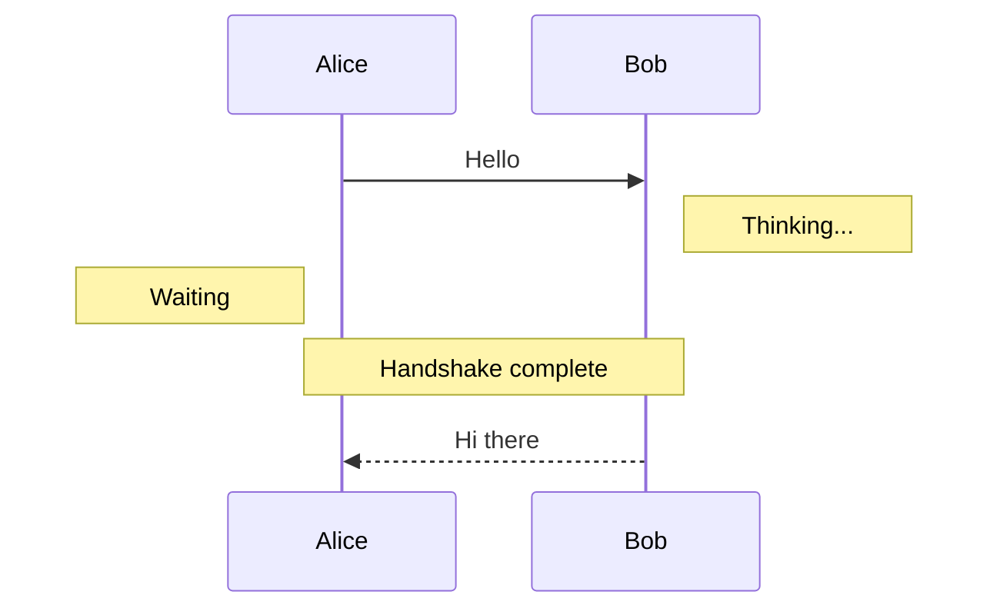

Positions: `right of`, `left of`, `over` (single or range with comma).

## Background Highlighting

Use `rect` to highlight a region of the diagram.

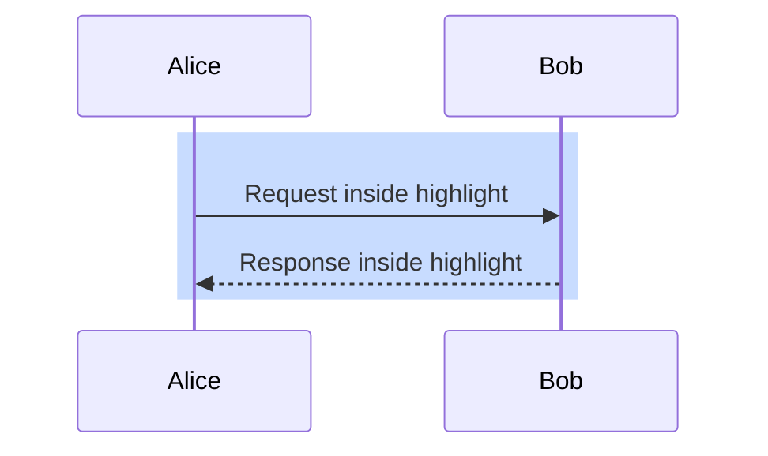

## Participant Grouping

Group participants into labeled boxes.

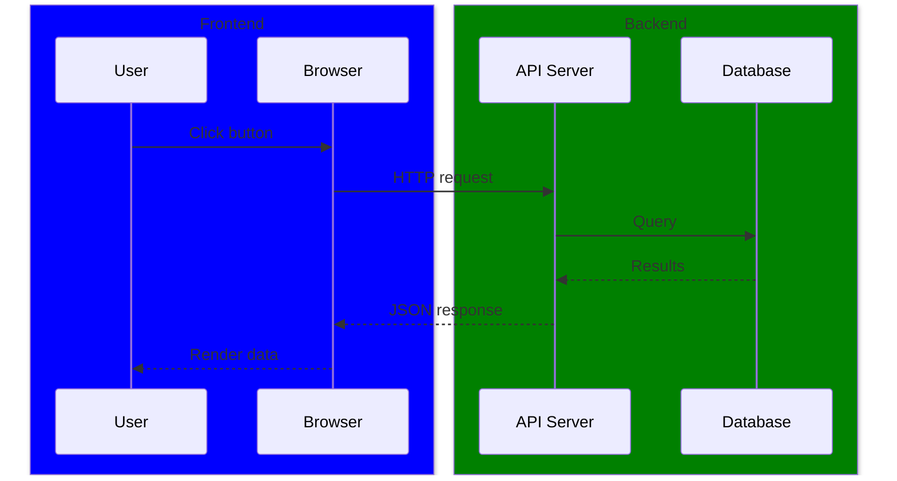

## Sequence Numbers

Enable automatic numbering on all messages.

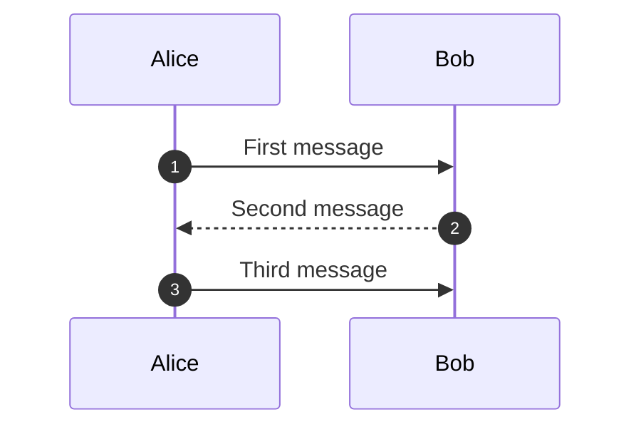

## Create and Destroy

Dynamically create or destroy participants during the sequence.

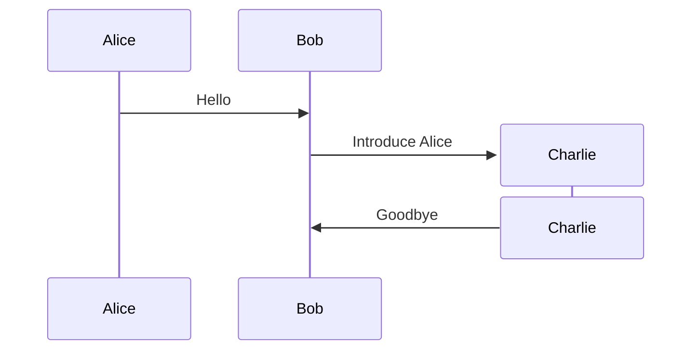

## Actor Menus

Add links to participant menus for interactive diagrams.

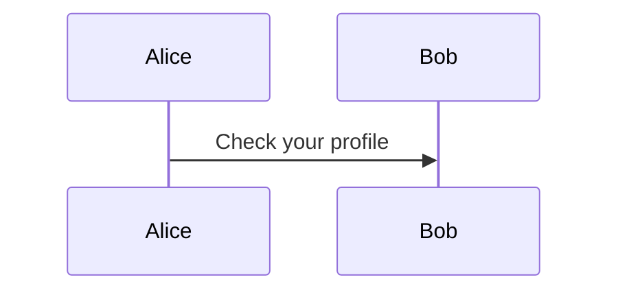

## Complete Example

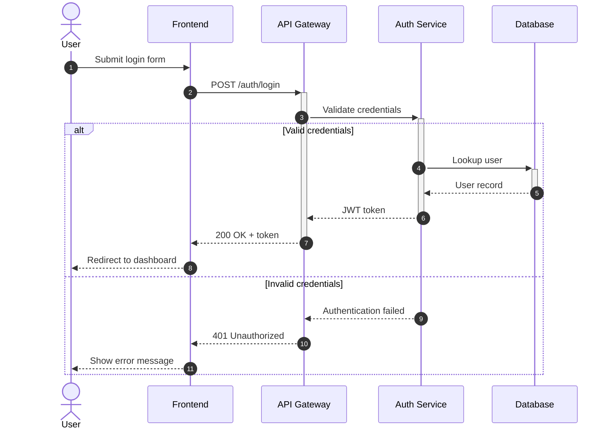
